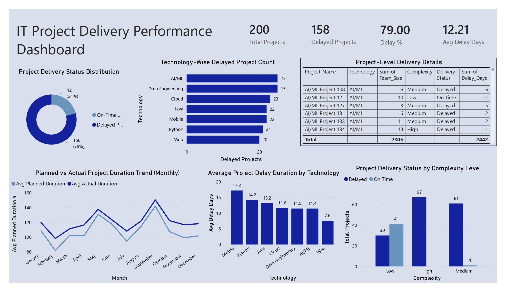

# 📊 IT Project Delivery Performance Dashboard

A comprehensive **Power BI Dashboard** designed to monitor and analyze IT project delivery performance across multiple technologies. The dashboard helps stakeholders identify project delays, evaluate delivery trends, and make data-driven decisions to improve project execution.

---

## 📷 Dashboard Preview

---

# 📌 Project Overview

This Power BI dashboard provides insights into project delivery performance by analyzing project schedules, delays, technology stacks, and complexity levels.

The dashboard enables project managers and business stakeholders to:

- Monitor project delivery status
- Identify delayed projects
- Analyze technology-wise project performance
- Compare planned vs actual project duration
- Understand delay patterns across different complexity levels
- Track average delay duration by technology

---

# 🎯 Business Problem

IT organizations often manage hundreds of projects simultaneously. Monitoring delivery timelines manually becomes difficult, making it challenging to identify delay trends and take corrective actions.

This dashboard solves that problem by providing a centralized view of project performance and highlighting critical delay metrics.

---

# 📂 Dataset

The dataset contains project-level information including:

- Project Name
- Technology
- Team Size
- Complexity Level
- Delivery Status
- Planned Duration
- Actual Duration
- Delay Days
- Project Month

---

# 📈 Dashboard KPIs

| KPI | Value |
|------|--------|
| Total Projects | 200 |
| Delayed Projects | 158 |
| Delay Percentage | 79% |
| Average Delay Days | 12.21 |

---

# 📊 Dashboard Visualizations

## 1. Project Delivery Status Distribution

- Displays the proportion of:
  - On-Time Projects
  - Delayed Projects

Purpose:
- Quickly evaluate overall project delivery performance.

---

## 2. Technology-Wise Delayed Project Count

Shows delayed projects across technologies:

- AI/ML
- Data Engineering
- Cloud
- Java
- Mobile
- Python
- Web

Purpose:
- Identify technologies experiencing the highest delivery delays.

---

## 3. Project-Level Delivery Details

A detailed project table containing:

- Project Name
- Technology
- Team Size
- Complexity
- Delivery Status
- Delay Days

Purpose:
- Drill down into individual project performance.

---

## 4. Planned vs Actual Project Duration Trend

Line chart comparing:

- Planned Duration
- Actual Duration

Across all months.

Purpose:
- Analyze scheduling efficiency throughout the year.

---

## 5. Average Project Delay by Technology

Displays average delay duration for each technology.

Purpose:
- Identify technologies with the highest average delays.

---

## 6. Project Delivery Status by Complexity

Compares delayed and on-time projects across:

- Low Complexity
- Medium Complexity
- High Complexity

Purpose:
- Understand how project complexity affects delivery performance.

---

# 🛠 Tools Used

- Microsoft Power BI
- Power Query
- DAX
- Data Modeling
- Excel (Dataset)

---

# 📌 Key Insights

- 79% of projects were delayed.
- AI/ML and Data Engineering recorded the highest number of delayed projects.
- Mobile projects experienced the highest average delay duration.
- High-complexity projects showed significantly higher delay rates.
- Actual project durations consistently exceeded planned schedules in several months.

---

# 📈 Business Value

This dashboard helps organizations:

- Improve project monitoring
- Detect delivery bottlenecks
- Optimize resource allocation
- Reduce project delays
- Support management decision-making
- Enhance project planning accuracy

---

# 🚀 Future Improvements

- Interactive drill-through reports
- Project manager performance analysis
- Department-wise project tracking
- SLA compliance dashboard
- Predictive delay forecasting using Machine Learning
- Automated data refresh
